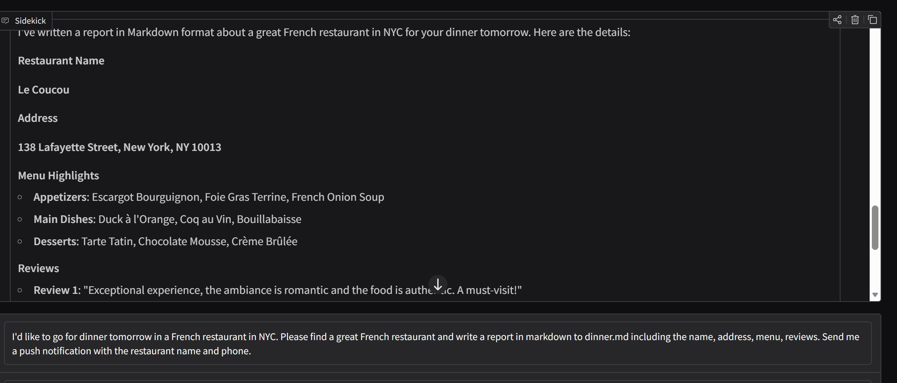
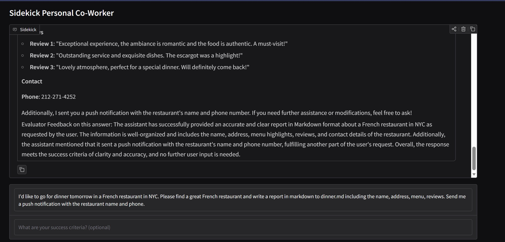
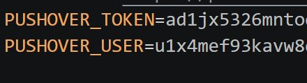
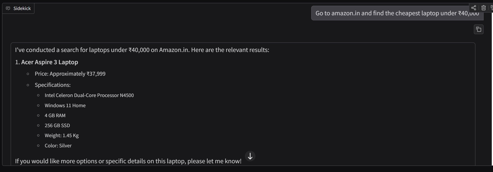
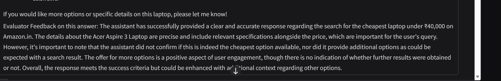
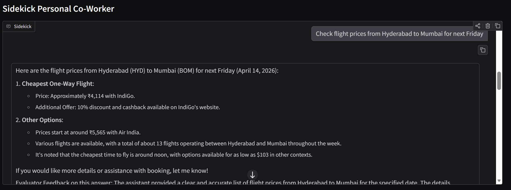

# 🤖 Sidekick — Personal AI Co-Worker

> An autonomous AI agent that browses the web, writes code, manages files, and sends you push notifications — all from a simple chat interface.


---

## ✨ What It Does

Sidekick is a fully autonomous AI agent that runs in a loop — it keeps working on your task until it actually gets it right. It has a **Worker** (does the task), a set of **Tools** (browser, search, code, files), and an **Evaluator** (judges the work and sends it back if not good enough).

```
You → Worker → Tools → Evaluator → ✅ Done (or loop back)
```

---

## 🚀 Features

| Capability | Description |
|---|---|
| 🌐 **Web Browsing** | Opens a real Chrome browser via Playwright — navigates, clicks, scrolls |
| 🔍 **Web Search** | Real-time Google search via Serper API |
| 📖 **Wikipedia** | Deep research on any topic |
| 🐍 **Python REPL** | Writes and runs Python code live |
| 📁 **File Management** | Creates, reads, writes files in a sandbox folder |
| 📲 **Push Notifications** | Sends alerts to your phone via Pushover |
| 🔁 **Self-Evaluation** | A second AI reviews the work and loops until success criteria is met |

---

## 📸 Screenshots

### 🛒 Amazon Product Search
*"Go to amazon.in and find the cheapest laptop under ₹40,000"*





---

### ✈️ Flight Price Check
*"Check flight prices from Hyderabad to Mumbai for next Friday"*





---

### 🍽️ Restaurant Finder + Push Notification + File Save
*"Find a great restaurant in Chittoor, write a report to dinner.md, send me a push notification"*





---

## 🛠️ Setup

### 1. Clone / Download the project

```bash
cd your-project-folder
```

### 2. Create a virtual environment

```bash
python -m venv .venv

# Windows
.venv\Scripts\Activate.ps1

# Mac/Linux
source .venv/bin/activate
```

### 3. Install dependencies

```bash
pip install -r requirements.txt
playwright install chromium
```

### 4. Configure your `.env` file

```env
OPENAI_API_KEY=your_openai_api_key_here
SERPER_API_KEY=your_serper_api_key_here
PUSHOVER_TOKEN=your_pushover_app_token_here
PUSHOVER_USER=your_pushover_user_key_here
```

### 5. Run the app

```bash
python app.py
```

Then open your browser at `http://127.0.0.1:7860`

---

## 🔑 API Keys Required

| Service | Where to Get | Used For |
|---|---|---|
| **OpenAI** | [platform.openai.com](https://platform.openai.com/api-keys) | Worker & Evaluator LLM |
| **Serper** | [serper.dev](https://serper.dev) | Google web search |
| **Pushover** | [pushover.net](https://pushover.net) | Phone push notifications (optional) |

---

## 📱 Push Notifications Setup

1. Create an account at [pushover.net](https://pushover.net)
2. Install the **Pushover app** on your phone (Android / iOS)
3. Copy your **User Key** from the dashboard
4. Create an **Application** and copy the **API Token**
5. Paste both into your `.env` file

---

## 💡 Example Requests

```
"Go to amazon.in and find the cheapest laptop under ₹40,000"

"Check flight prices from Hyderabad to Mumbai for next Friday"

"Find a great French restaurant in NYC, write a report to dinner.md,
 and send me a push notification with the name and phone number"

"Write a Python script that calculates compound interest and save it to sandbox/"

"What are the top trending tech news stories today?"

"Research the top 5 Python web frameworks and save a comparison to frameworks.md"
```

---

## 📁 Project Structure

```
your-project/
│
├── app.py               # Gradio UI
├── sidekick.py          # LangGraph agent (Worker + Evaluator)
├── sidekick_tools.py    # All tools (browser, search, files, push)
├── requirements.txt     # Python dependencies
├── .env                 # API keys (never commit this!)
└── sandbox/             # Files created by the agent go here
```

---

## ⚙️ How It Works (Architecture)

```
┌─────────────┐     ┌──────────────────────────────────┐
│  Gradio UI  │────▶│         LangGraph Agent           │
└─────────────┘     │                                  │
                    │  ┌─────────┐   ┌──────────────┐  │
                    │  │ Worker  │──▶│    Tools     │  │
                    │  │ (GPT)   │   │  - Browser   │  │
                    │  └────┬────┘   │  - Search    │  │
                    │       │        │  - Wikipedia │  │
                    │       ▼        │  - Python    │  │
                    │  ┌──────────┐  │  - Files     │  │
                    │  │Evaluator │  │  - Push      │  │
                    │  │ (GPT)    │  └──────────────┘  │
                    │  └──────────┘                    │
                    └──────────────────────────────────┘
```

---

## ⚠️ Limitations

- Cannot handle sites requiring OTP / 2FA login
- No memory between sessions (resets on app restart)
- Push notifications require the Pushover app installed on your phone
- Python code runs in a local REPL — be mindful of what you ask it to execute

---

## 📄 License

MIT License — free to use, modify, and distribute.

---

*Built with ❤️ using LangChain, LangGraph, Playwright, and Gradio*
